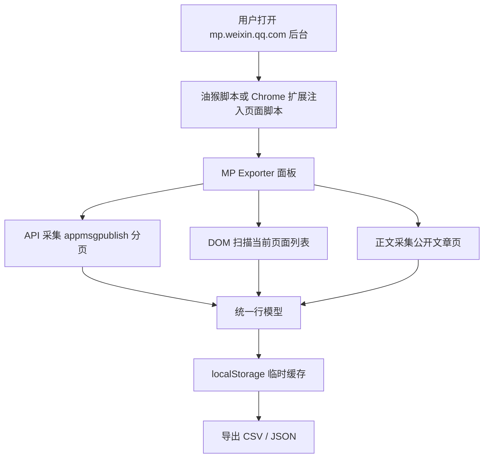

# 设计文档

## 目标

为微信公众号后台提供一个本地数据导出工具，帮助账号运营者导出自己有权限访问的文章数据，用于内容分析、复盘和备份。

设计目标：

- 本地运行，不依赖外部服务。
- 不保存 Cookie 或 token。
- 不上传数据。
- 支持油猴脚本和 Chrome 扩展两种安装形态。
- 支持 API 采集和 DOM 采集两种数据来源。
- 使用低频单线程采集，避免短时间请求过多。

## 架构



## 数据来源

### API 模式

API 模式在已登录页面内，对同源地址发起请求：

```text
/cgi-bin/appmsgpublish?sub=list&begin=...&count=10&token=...&lang=zh_CN&f=json&ajax=1
```

请求使用浏览器当前登录态，由浏览器自动携带必要 Cookie。脚本不会读取、保存或导出 Cookie。

### DOM 模式

DOM 模式扫描当前页面已经渲染出来的文章卡片，提取标题、发布时间、数字指标和链接。它不依赖后台接口，但更容易受到页面结构变化影响。

### 正文模式

正文模式基于文章 `content_url` 访问公开文章页，解析：

- `#activity-name`
- `#js_name`
- `#publish_time`
- `#js_content`

CSV 导出正文纯文本；JSON 导出正文纯文本和 HTML。

## 数据模型

内部统一使用行对象：

```js
{
  appmsg_id: "",
  publish_id: "",
  idx: "",
  publish_time: "",
  title: "",
  status: "",
  is_original: "",
  read_num: 0,
  like_num: 0,
  share_num: 0,
  favorite_or_collect_num: "",
  comment_num: "",
  api_moment_like_num: "",
  content_url: "",
  cover_url: "",
  article_text: "",
  article_fetch_status: "",
  article_fetch_error: "",
  article_content_html: "",
  source: "api,content",
  collected_at: ""
}
```

去重规则：

1. 优先使用 `content_url`。
2. 如果没有链接，则使用 `appmsg_id + idx`。
3. 如果仍没有 ID，则使用 `publish_id + idx + title`。
4. 最后使用 `title`。

已删除、无正文链接或正文抓取失败的文章仍保留在列表导出中，并通过 `article_fetch_status` 标记。

默认 CSV/JSON 导出会隐藏部分内部字段：

- `publish_id`：微信接口在当前列表中不稳定，常为空。
- `idx`：单图文账号通常恒为 `1`，分析价值有限。
- `is_original`：DOM 页面可见但 API 全量模式不稳定，避免导出大量空列。
- `raw_numbers`：DOM 扫描调试字段，API 模式无意义。

## 采集节奏

脚本使用单线程队列，不并发请求。

默认间隔：

- API 分页：`5-12` 秒。
- 正文采集：`9-22` 秒。
- 分页点击：`4-9` 秒。
- 滚动扫描：`2.5-6.5` 秒。
- 异常退避：`45-90` 秒。

所有间隔使用随机范围，目的是降低请求峰值，而不是绕过平台安全机制。

## Chrome 扩展实现

扩展目录包含：

- `manifest.json`：声明匹配页面和资源权限。
- `content.js`：把页面脚本注入到 `mp.weixin.qq.com` 页面。
- `wechat_mp_recent_export.user.js`：与油猴版相同的核心逻辑。

扩展不包含后台 service worker，也不与外部服务通信。

## 限制

- 微信后台或公开文章页结构变化时，字段解析可能需要更新。
- 如果登录态过期，API 模式会失败。
- 正文采集只抓公开文章页可访问内容。
- CSV 不适合保存大量 HTML，因此 HTML 只放在 JSON 导出中。

## 后续可改进

- 增加断点续采状态面板。
- 增加字段映射配置。
- 增加导出前预估耗时。
- 增加更明确的失败日志下载。
- 将油猴脚本和扩展核心代码拆成共享源码，减少重复维护。
